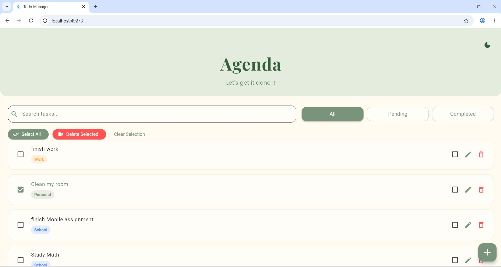
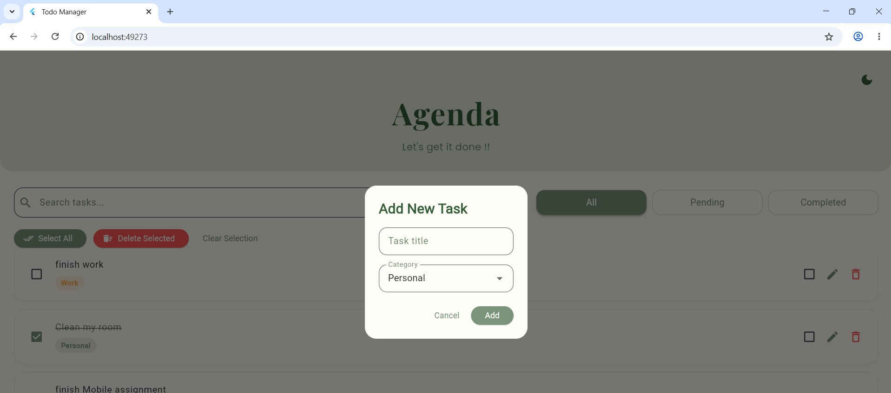
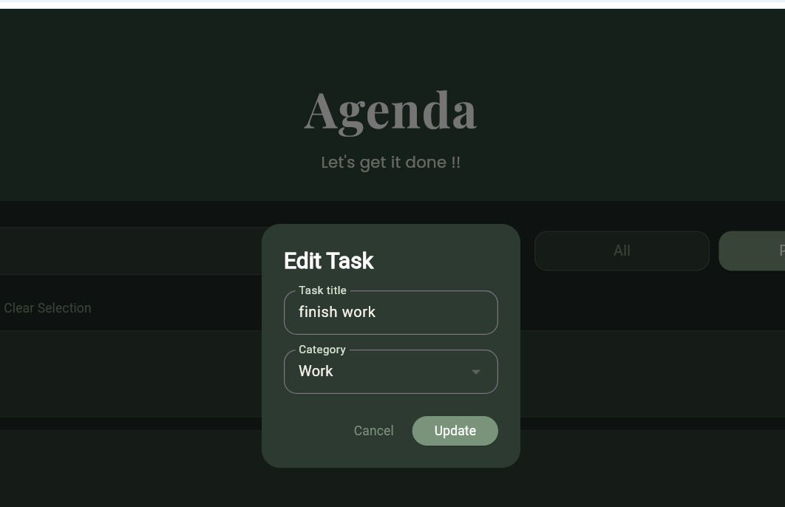
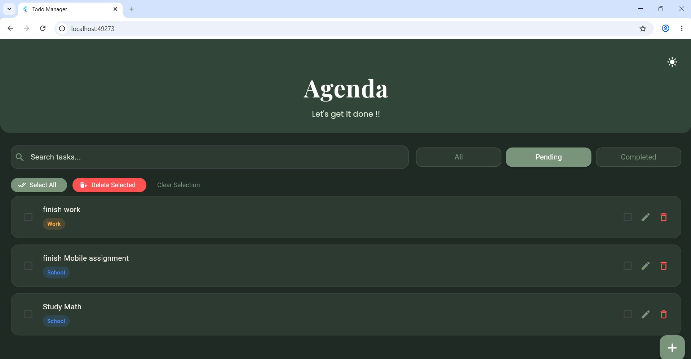

# Agenda - Todo Manager App

Agenda is a modern Flutter Todo Manager application built using Dio and Bloc/Cubit state management.

The application performs CRUD (Create, Read, Update, Delete) operations using the JSONPlaceholder API while providing a clean and elegant sage green themed user interface.

---

# Features

- Create new tasks
- Read and display tasks
- Update/edit tasks
- Delete tasks
- Mark tasks as completed
- Search tasks
- Filter tasks by:
  - All
  - Pending
  - Completed
- Categorize tasks:
  - School
  - Personal
  - Work
- Dark mode support
- Select all tasks
- Delete selected tasks
- Snackbar feedback messages
- Beautiful modern UI

---

# Technologies Used

- Flutter
- Dart
- Dio
- Flutter Bloc / Cubit
- Google Fonts
- JSONPlaceholder API

---

# API Used

This project uses the public JSONPlaceholder API:

https://jsonplaceholder.typicode.com/todos

JSONPlaceholder is a mock REST API commonly used for learning and testing CRUD operations.

---

# Project Structure

```txt
lib/
 ├── main.dart
 ├── models/
 │    └── todo_model.dart
 ├── services/
 │    └── todo_api_service.dart
 ├── cubit/
 │    ├── todo_cubit.dart
 │    └── todo_state.dart
 └── screens/
      └── home_screen.dart

# Screenshots

## Home Screen



## Add Task



## Edit Task



## Dark Mode



---

# How to Run the Project


1. Clone the repository
git clone https://github.com/Fenetmeng/agenda-todo-bloc-dio.git?authuser=0
2. Open the project folder
cd todo_bloc_dio_app
3. Install dependencies
flutter pub get
4. Run the app
flutter run

# Author

Fenet Tufa
